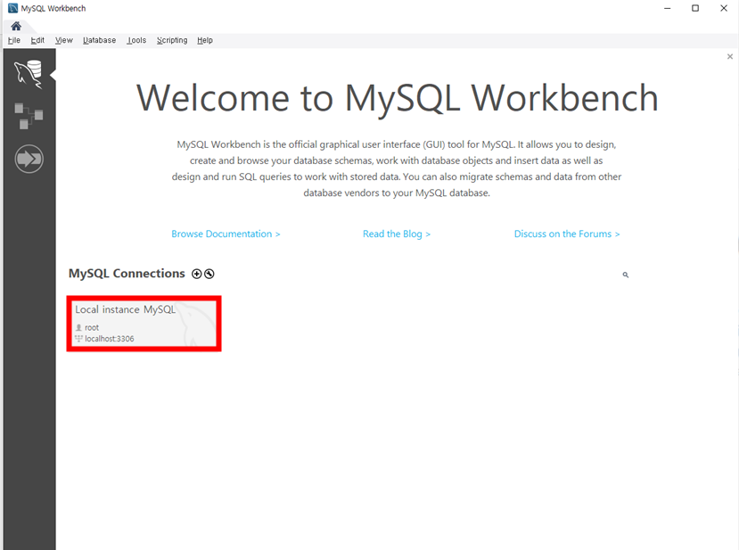
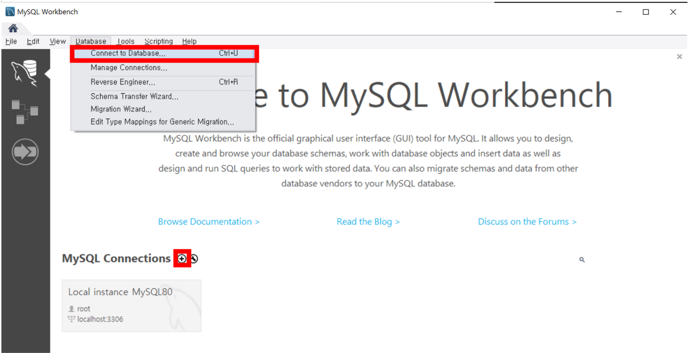
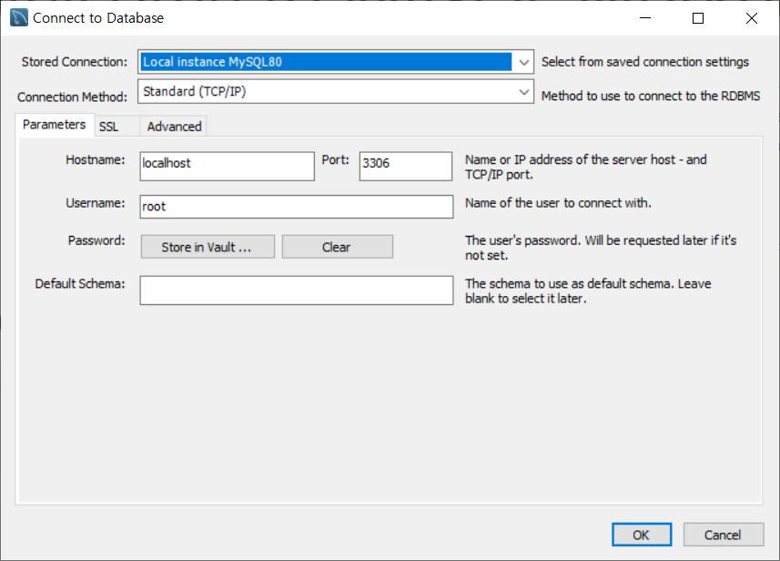
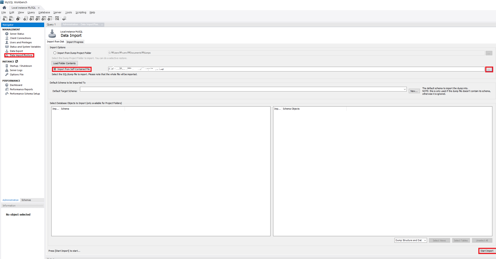
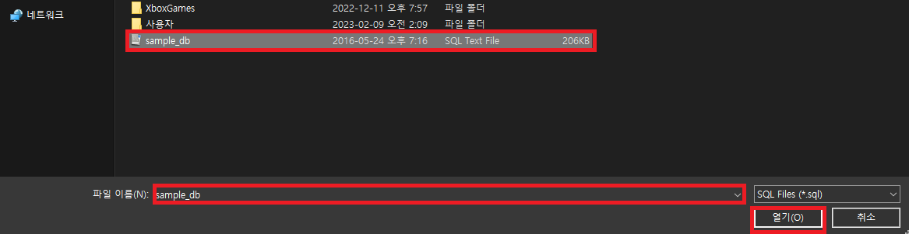
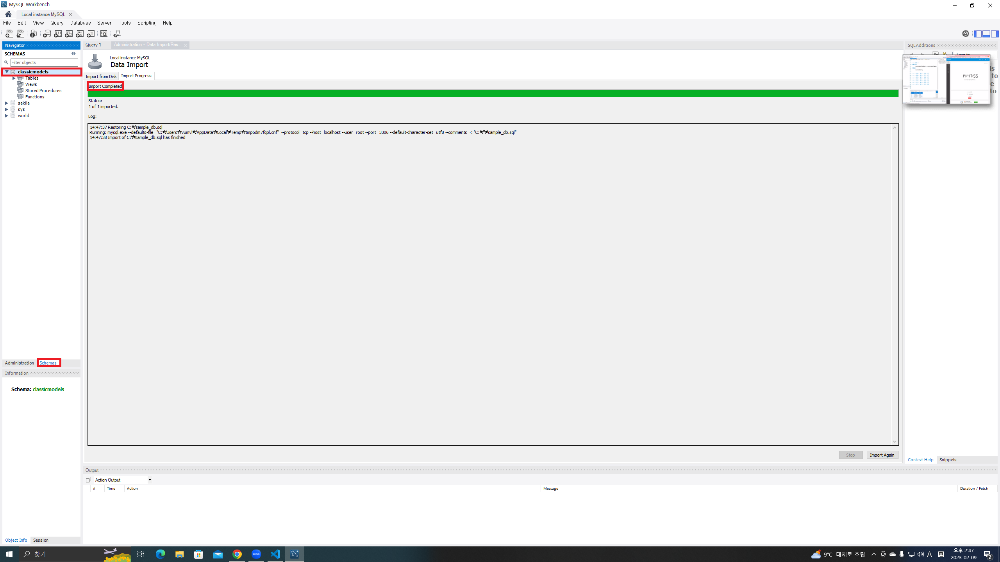
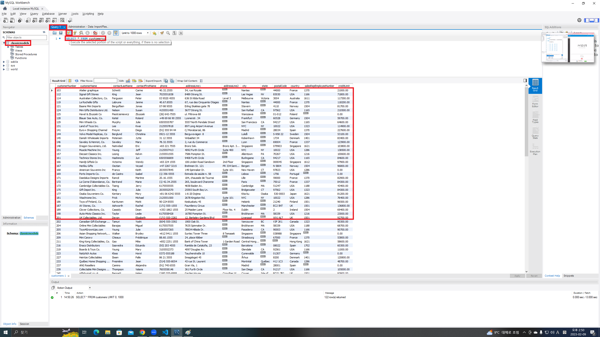

# Workbench 활용 MySQL 접속 방법
### 1. 로컬 호스트로 MySQL연결
1. 로컬 호스트로 연결하려면

2. 외부 DB에 연결하려면

### 2. 실습 데이터베이스(Localhost 상황, 저장된 값)에 대한 쿼리(Query)문 작성 및 쿼리문 실행 방법
1. 저장된 DB 불러오기

만일 import error가 발생했다면 사용자폴터명이 한글이기 때문 -> 새 계정을 판다

import가 성공했다면

schema -> 해당 모델의 query에서 SELECT를 통해 내용을 출력해본다

