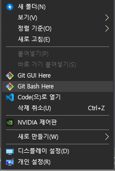
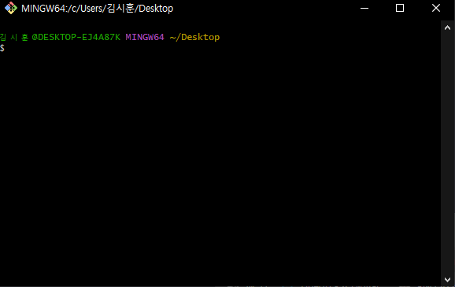
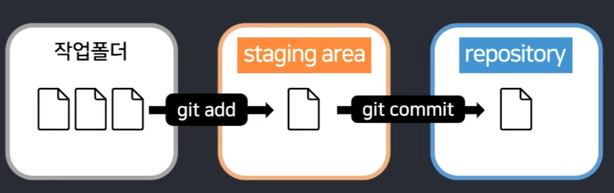

# 마크다운 문법
## 헤더
```
# H1
## H2
### H3
#### H4
##### H5
###### H6
```
## 인용문
> 이것이 `인용문`이다
```
>               인용1
>   >           인용2
>   >   >       인용3
```
## 목록
### 1. OrderedList(ol)
```
1. 첫번째
2. 두번째
3. 세번째
```
### 2. UnorderedList(ul)
```
* 점심메뉴
  * 햄버거
    * 패티
```
* 점심메뉴
  * 햄버거
    * 패티
## 코드블럭
```
' ``` '로 위아래를 감싼다!
```
```c
#include <stdio.h>
int main(void){
    printf('Hello World!');
    return 0;
}
```
## 문자수식
* 색강조 : `
* 기울임 : *
* 굵기 : **
* 수평선 : ***

## 표   
```
|제목|내용|설명|
|------|---|---|
|테스트1|테스트2|테스트3|
|테스트1|테스트2|테스트3|
|테스트1|테스트2|테스트3|
```
### <예시>
|과목|점수|등급|
|------|---|---|
|`국어`|100| 1|
|`수학`|100| 1|
|`영어`|100| 1|

> 표 그리는 사이트를 적극 활용하자   

## 파일/이미지 삽입
```
  이미지 삽입 : 
  파일 삽입   : [](파일_소스 경로)
  
* 절대경로 및 상대경로 참조에 주의한다
```
***

# CLI/GUI란
## 1. 개념
`CLI` (Command line interface) 또는 명령어 **인터페이스**는 가상 터미널 또는 텍스트 터미널을 통해 사용자와 컴퓨터가 상호 작용하는 방식을 뜻한다.   
`작업 명령` 은 사용자가 툴바 키보드 등을 통해 문자열의 형태로 입력하며, 컴퓨터로부터의 출력 역시 문자열의 형태로 주어진다.   
이 같은 **인터페이스**를 제공하는 프로그램을 명령 줄 `해석기` 또는 `셸`이라고 부른다.   
이를테면, 유닉스 셸(sh, ksh, csh, tcsh, bash 등)과 CP/M. 도스의 command.com이 있다.   
`GUI` (Graphic user interface)는 사용자가 편리하게 사용할 수 있도록 입출력 등의 기능을 알기 쉬운 아이콘 따위의 그래픽으로 나타낸 **인터페이스**이다   

## 2. [Git-Bash 사용예시]
폴더 내에서 마우스 우클릭, 'Git Bash here'   

　　　　　　
```
1. 폴더 내 파일 리스트; ls   
2. 폴더 생성; mkdir 파일이름   
3. 하위 폴더 입장; cd 파일이름   
4. 상위 폴더 회귀; cd ..     
5. 파일 만들기; touch 파일이름.확장명   
6. 삭제; rm 파일이름   
7. 폴더 삭제; rm -r 폴더이름
ls(list) mkdir(make directory) cd(change directory) .현재폴더 ..상위폴더 rm(remove), r(recursive;재귀)   
~(home) $(readysign)
```   
# 버전관리
## 의미
`버전관리`의 의미를 이해하고 `버전관리도구`에 대해 이해한다
일반적인 관리도구는 자료 간에 뭐가 바뀌었는지 차이(diff)를 알 수 없다.   
```
-중앙집중식버전관리시스템 : 로컬에서는 파일을 편집하고 서버에 반영중앙 서버에서만 버전을 관리   
-분산버전관리시스템` : 로컬에서도 버전을 기록하고 관리 원격 저장소를 활용하여 협업. GIT.
 ```
## GIT을 통한 버전관리
```
1. 작업을 하고(보고서 작성)
2. 변경된 파일을 모아서(add)
3. 저장을 한다 제출(commit -m)
```

## <예시>
````
폴더 생성 및 마우스 우클릭으로 VSCode 실행   
New terminal -> Git-Bash 실행 및 입력       
touch readme.md                                 readme.md 파일 생성
git init                                        git repository 설정
git config --global user.email "이메일"          git 이메일 설정
git config --global user.name "사용자이름"       git 사용자이름 설정
git add readme.md                               변경된 파일을 모은다
git add .                                       (폴더내 파일 한번에 모으기)
git commit -m readme.md                         제출한다
git status                                      상태를 본다
git log --all --oneline                         기록을 본다
````
